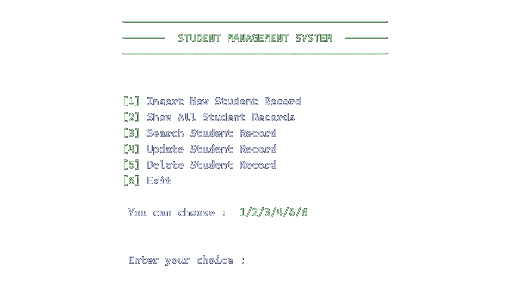

# Data to text file

This is an assignment for creating CRUD methods about _Student List_ while using the file as the data structure at <a href="https://www.facebook.com/brachnasastraBTI">BTI</a>

You can try by downloading this <a href="main.exe">main.exe</a>

## Members

1. <a href="https://t.me/sornsarim">Sorn Sarim</a>
2. <a href="https://t.me/samithseu">Seu Samith</a>
3. <a href="https://t.me/NyReach">Mao Samphors</a>
4. <a href="https://t.me/credit_officer">Phok Rathanak</a>
5. <a href="https://t.me/Userrom5220">Sun Rom</a>
